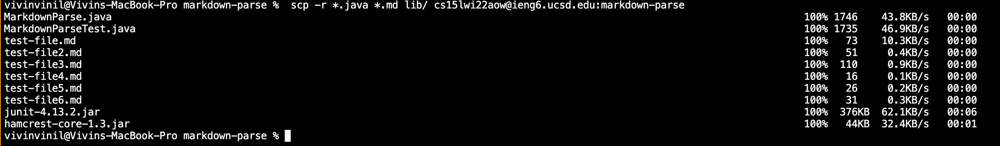
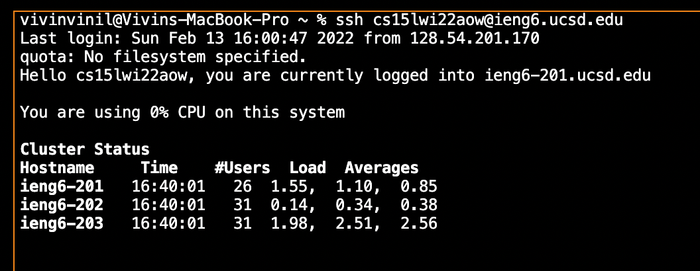
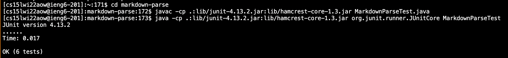
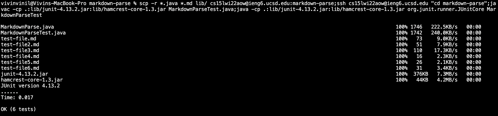

# _**VIVIN'S LAB REPORT 1:**_

# _**GROUP OPTION 3 MOVING ENTIRE DIRECTORY **_

# STEP 1: Copying full diretory
 

As seen above I ran the following code to copy my full directory to ieng 6
``` scp -r *.java *.md lib/ cs15lwi22aow@ieng6.ucsd.edu:markdown-parse``` in order to copy over the full directory, this is far more effective than doing each file individually. 

# STEP 2: Logging in and Running the tests on ieng6 after scp 




As seen above I after logging into my user account ```cd``` to markdown-parse and run the tests. Using the standard command: 

``` javac -cp .:lib/junit-4.13.2.jar:lib/hamcrest-core-1.3.jar MarkdownParseTest.java```

```java -cp .:lib/junit-4.13.2.jar:lib/hamcrest-core-1.3.jar org.junit.runner.JUnitCore MarkdownParseTest```


# STEP 3: Running scp,ssh and the tests all in one line:



As seen above I used the tips from week 1 to combine running the commands in one line. It was important to remember to use 
``` ssh cs15lwi22@ieng6.ucsd.edu "markdown-parse" to move into the markdown parse directory before running compiling and running the test file. 
I used the following overall command:

``` 
scp -r *.java *.md lib/ cs15lwi22@ieng6.ucsd.edu:markdown-parse;ssh cs15lwi22@ieng6.ucsd.edu "markdown-parse";javac -cp .:lib/junit-4.13.2.jar:lib/hamcrest-core-1.3.jar MarkdownParseTest.java;java -cp .:lib/junit-4.13.2.jar:lib/hamcrest-core-1.3.jar org.junit.runner.JUnitCore MarkdownParseTest ```

# THANK YOU!

