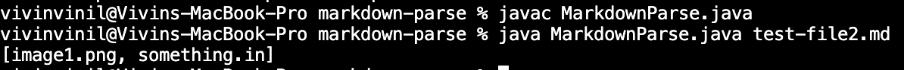
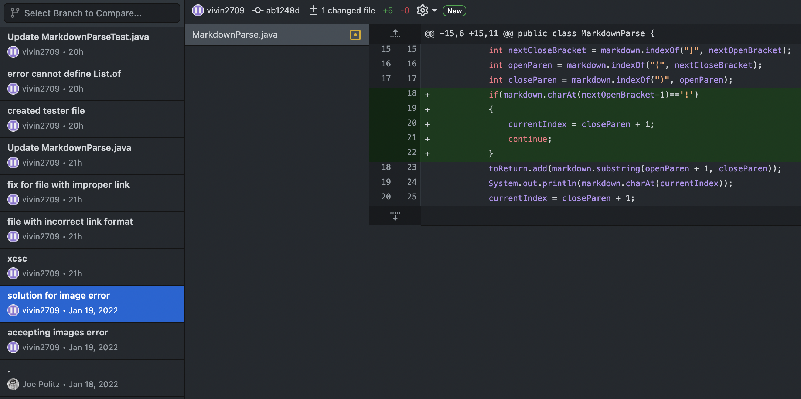
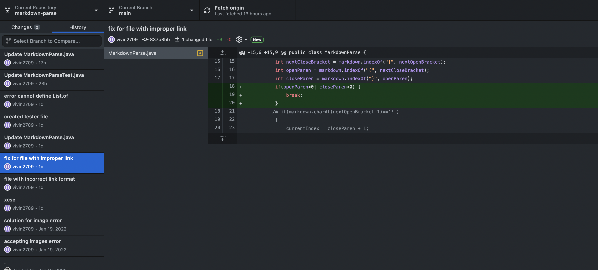
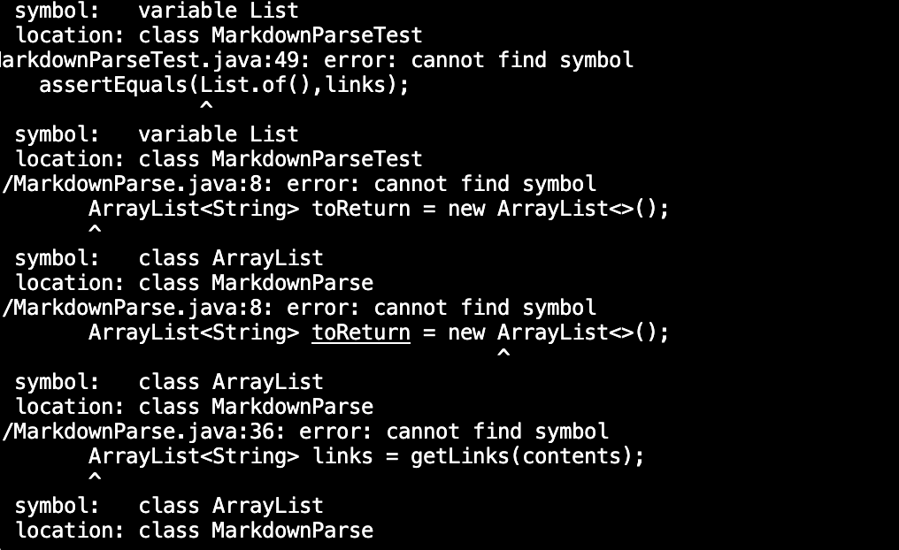
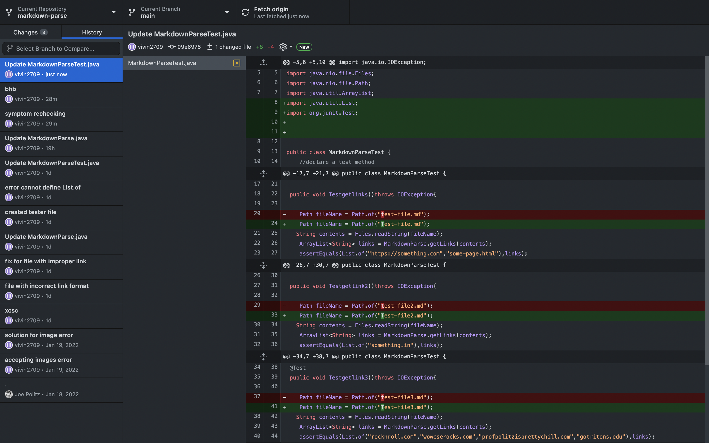

# _**VIVIN'S LAB REPORT 2:**_

# Code Change 1:
This change will aim to fix the error of having an image in the frist line after the title of the [test file](Test-file2.md). Essentially allowing the code to work on files with both links and images.
The symptom is shown below:

As seen the image name is also printing which shouldn't happen as this is only to print actual links and not image names.

The following code change was made: 


Finally as seen above we added an if statement to ensure 

```
 if(markdown.charAtnextOpenBracket-1)=='!') 
```
By doing so we check if the ! mark exists after the first '(' we know its an image and hence dont need this data and we use 'continue' to skip this line and go to the next. By doing so everytime we hit a '!' we dont record the image name and instead go to the next line to check for a link. Hence the bug is resolved. 

# Code Change 2:
This change will aim to fix the error where we have a link that is incorrectly formatted which means the link in the [test file](Test-file4.md) only has a [] brackets and no parenthesis. Which was leading to an index out of bounds exception.As shown below. THe symptom was the exception we saw being thrown in the terminal.



On seeing this error, I decided to make some code changes as shown below. 

[fix](improperlinkfix.png)

I noticed that the code was throwing an IndexOutOfBounds Excpetion as there were no parenthesis in the code therefore openParen<0 and closeParen were both -1. And when we called the substring function it was throwing an error since -1 is out of bonds. We fixed this bug by adddding the following statement:

```
 if(openParen<0 || closeParen<0) {
    break;
            } 
```
By doing so we ensure that in the first line if there is no parenthesis and closeParen and openParen are -1, the code doesnt throw an exception, since we added this if statement before substring is called, it simply breaks out of the loop, when there are no parenthesis.

# Code Change 3:

This change fixed a symbol not found error as I was running my tester file which uses [test-file](Test-file.md), [test-file2](Test-file2.md) and [test-file3](Test-file3.md). Since i hadnt imported the List and Array list classes I was unable to refer to their methods and got the symptom of my error shown below.


This bug was simply occuring as I hadnt imported the required package i.e List and thereofore got an error everytime I tried to use an arraylist. The code fix is shown below: 



As seen above, I just had to add the import statements for list and arrayList so I could create an array List and use the List.of method in my test. Moreover we had renamed the test test files to have a Capital 'T' so I also had to change that. After which the code ran successfully and all the tests passed. 