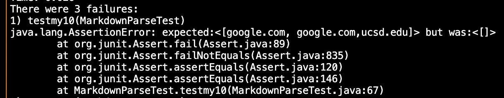
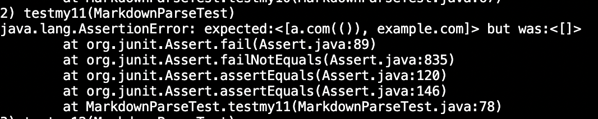
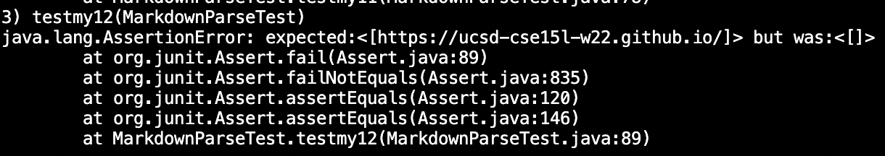

# _**VIVIN'S LAB REPORT 4:**_

# _**LINKS NEEDEDED FOR THIS LAB REPORT:**_

[my implementation](https://github.com/vivin2709/markdown-parse)

[Implemenataion reveiewed](https://github.com/aldrincheung/markdown-parse)

JUNIT TESTS CREATED FOR SNIPETTS 1,2 AND 3 ON THEIR IMPLEMENTATION:

Snippet 1 test output: Failed

FAILREVIEW.png)

Snippet 2 test output: Failed

Snippet 3: Failed 

JUNIT TESTS CREATED FOR SNIPETTS 1,2 AND 3 ON MY IMPLEMENTATION:

Snippet 1 output: Failed

In order for us to fix this change I think there is a 1 line code that could fix this 

Snippet 2 output: Failed

Snippet 3 output: Failed

