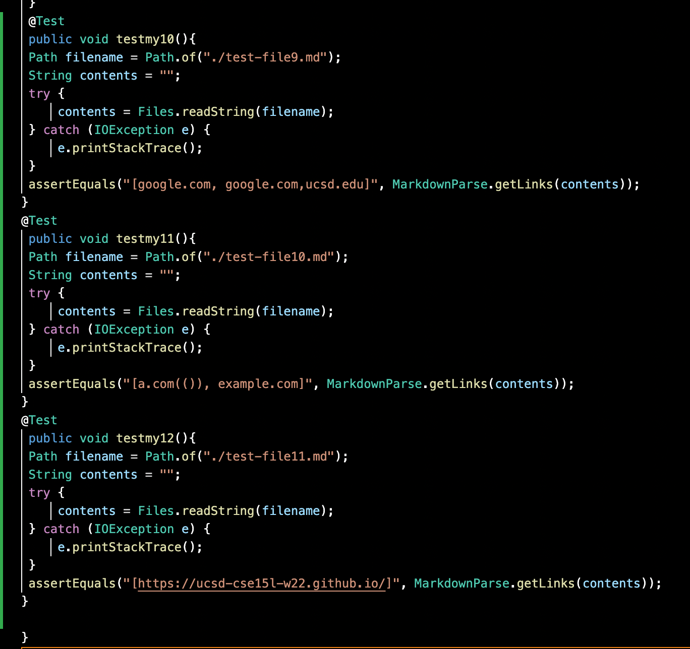

# _**VIVIN'S LAB REPORT 4:**_

# _**LINKS NEEDEDED FOR THIS LAB REPORT:**_

[my implementation](https://github.com/vivin2709/markdown-parse)

[Implemenataion reveiewed](https://github.com/aldrincheung/markdown-parse)

JUNIT TESTS CREATED FOR SNIPETTS 1,2 AND 3 ON THEIR IMPLEMENTATION:


Snippet 1 test output: Failed

FAILREVIEW.png)

Snippet 2 test output: Failed


Snippet 3: Failed 


JUNIT TESTS CREATED FOR SNIPETTS 1,2 AND 3 ON MY IMPLEMENTATION:



Snippet 1 output: Failed


There is no small code change that can fix this error. Since by simply adding an if statement that accounts for the backticlks, will lead to many other test cases failing as in line 28 by addding an or to the statement, it changes the value to be returned. A potential fix could have been:

```
if(markdown.charAt(openParen-1)==']'||if(markdown.charAt(openParen-1)==']'))

``` 

However this causes a variety of tests to fail therefore we would need specific if statements to ensure that even within the () where we have the link if we have a ` it should be included in the outputted link. Moreover, the statement whioch defines the value would also have to be changed since we would have to change the value from where wee begin picking up the link. It won't simply be first instance of '`'+1 since that won't work for the other test cases. It would have to be a very involved change since we would also have to ensure that other test cases have their own special if cases.

Snippet 2 output: Failed


Snippet 3 output: Failed


