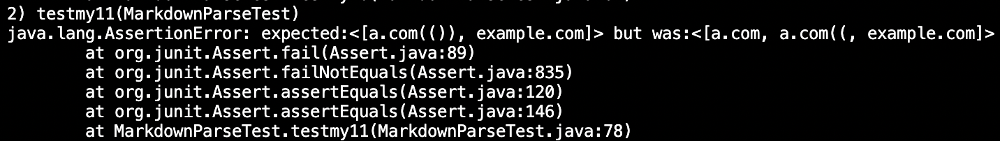

# _**VIVIN'S LAB REPORT 4:**_

# _**LINKS NEEDEDED FOR THIS LAB REPORT:**_

[my implementation](https://github.com/vivin2709/markdown-parse)

[Implemenataion reveiewed](https://github.com/aldrincheung/markdown-parse)

For all the tests created I used the preview on VS CODE to see which links actually worked from the Code snippets and only then created the tests to check if my implementation and that of the reviewed group was able to handle it. 

JUNIT TESTS CREATED FOR SNIPETTS 1,2 AND 3 ON THEIR IMPLEMENTATION:


 # _**Snippet 1 output: Failed: their implementation**_

FAILREVIEW.png)

 # _**Snippet 2 output: Failed: their implementation**_


 # _**Snippet 3 output: Failed: their implementation**_


JUNIT TESTS CREATED FOR SNIPETTS 1,2 AND 3 ON MY IMPLEMENTATION:


 # _**Snippet 1 output: Failed:**_


There is no small code change that can fix this error. Since by simply adding an if statement that accounts for the backticlks, will lead to many other test cases failing as in line 28 by addding an or to the statement, it changes the value to be returned. A potential fix could have been:

``` if(markdown.charAt(openParen-1)==']'||if(markdown.charAt(openParen-1)==']')) ```

However this causes a variety of tests to fail therefore we would need specific if statements to ensure that even within the () where we have the link if we have a ` it should be included in the outputted link. Moreover, the statement whioch defines the value would also have to be changed since we would have to change the value from where wee begin picking up the link. It won't simply be first instance of backtick+1 since that won't work for the other test cases. It would have to be a very involved change since we would also have to ensure that other test cases have their own special if cases.

 # _**Snippet 2 output: Failed:**_



Similarly here there is no less than 10 line code change that could fix the error. Since we have to rest our entire code to work with the last index of ')' rather than just indexOf ')'. This is hard to do since it would first cause all the original variables to change which include 
```
    int nextOpenBracket = markdown.indexOf("[", currentIndex);
    int nextCloseBracket = markdown.indexOf("]", nextOpenBracket);
    int openParen = markdown.indexOf("(", nextCloseBracket);
    int closeParen = markdown.indexOf(")", openParen); 
```

    Moreover we would also have to rework all the if statements to math these new initial values. Also causing a chnage in the value to be returned and possibly creation of some mini strings to make our final output clearer. This would be a involved change which would fundamentall change the code as it would be possible to account for the multiple closed brackets wihtout changing our inital variables. 

 # _**Snippet 3 output: Failed:**_


