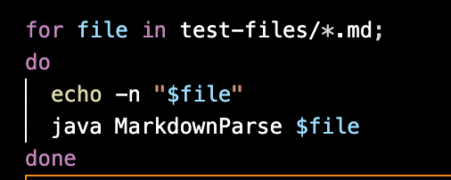
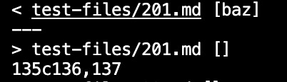
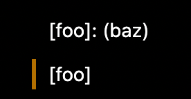
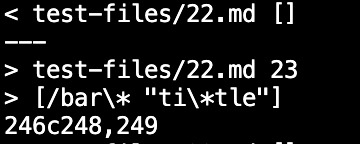

# _**VIVIN'S LAB REPORT 5:**_

# _**LINKS NEEDEDED FOR THIS LAB REPORT:**_

[My Implementation](https://github.com/vivin2709/markdown-parse)

First in order to get the diff files I used the following command after creating the different result text files. 

```diff markdown-parse/results.txt markdown-parse-their/results.txt```

I also edited my script.sh file as follows in order to help create the results files. 



This helped me find the different outputs and I will analyse the following tests.

In the following screeshots, their (given by the prof) implementation is the one on top. While mine is the second one (lower output.)

# _**TEST 1:**_



The expected output from the given output files in test is:


However, it interesting to see that my implemetation returns an empty list as that is the correct output. Since there is no valid link showing in the VS Code preview. 

Bug in their implementation:
 This bug can be fixed by checking for a colon after the ```]``` . Moreover, the class should also add an if  case to ensure that if there is a colon it is not a valid link, we retrieve the character at ```:``` +1) and add a continue statement there. It will fix the code. 

# _**TEST 2:**_



The expected output from the given output files in test is:
 

so clearly the expected output is [foo], since it works as a valid link.

Both implementations give the wrong output in this case.

Bug in my implementation: 
Essentially our code does not check for ```\``` and ```*``` adding an if statement to include these within the string markdown, will allow these to be addded to our output. The string we are returning for each link is based only on the value of open and close paren it does not account for quotes within the brackets of the link either. If cases to include these special characters and still count the link as valid is required. 
