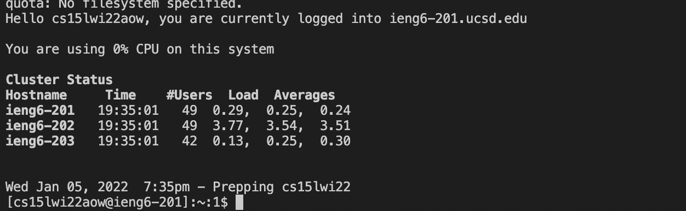
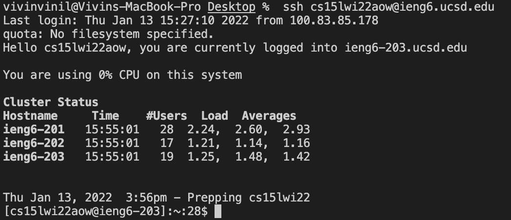
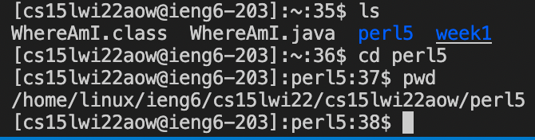
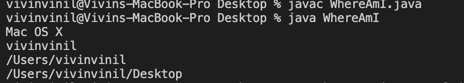
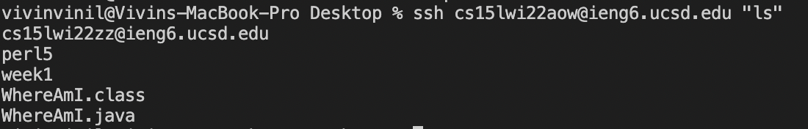

# Vivin's Lab Report 1:

# STEP 1: Installing VS Code 

The first step is to download the VS code for your respective system. I like many students had VS Code and Java downloaded already since I did CSE 11. However, its important to make sure the Version is the latest version and that you download VScode only from the official source. 

# STEP 2: Remotely Connecting 

The next step was to connect remotely. First we went to the following link and found our course specific accounts. -

|> https://sdacs.ucsd.edu/~icc/index.php

Then used the following command to connect to the server: where aow is my specific account for other students it will be different.
ssh cs15lwi22aow@ieng6.ucsd.edu. It then asked for a password on entering it I was logged in. 

# STEP 3: Trying Some Commands 

We tried some different commands, one was cd which essentially changed directory to a file deeper within the file System. Essentially
cd file name. We also had ls which listed the files in a certain directory. cd.. Helped in going back to the upper directory, almost like a reverse cd.  pwd was another interesting command that we used which gives the filepath to the file you're currently in. 

# STEP 4: Moving files with scp 

In this step we use the scp command to move files from our local computer to the ieng6 server. We use the command as shown above. Another intereting thing to note is the difference in the output when we run the whereAmI. java file on the local computer and on the server. THe local computer shows macOS, since I use a mac, while the client uses Linux and thats what is outputted on running the file after moving it to the server.       

# STEP 5: Setting an SSH Key  

In order to easily log into our CSE 15L accoount in the future without using a password we must set up a ssh key. Basically a pair of files is created with ssh-keygen, a private key and public key. The piblic key is copied to the ieng server and the private key remains on our local computer. 

# STEP 6: Optimizing remote running

To further optimize running remotely we ca  use some moer commands. For example the statement above allows us to log into the servers carry out the command 'ls' and then logs out again. This is done in one line by putting the  command in quotes after the ssh command. The entire command is written below: We can use any command in quotes, for this example we have used ls. 

|>ssh cs15lwi22@ieng6.ucsd.edu "ls" 

Another easy trick is to use the up-arrow on your keyboard to recall the last command that was run. This optimizes the command process and saves time by not having to repeatedly type out commands. 

